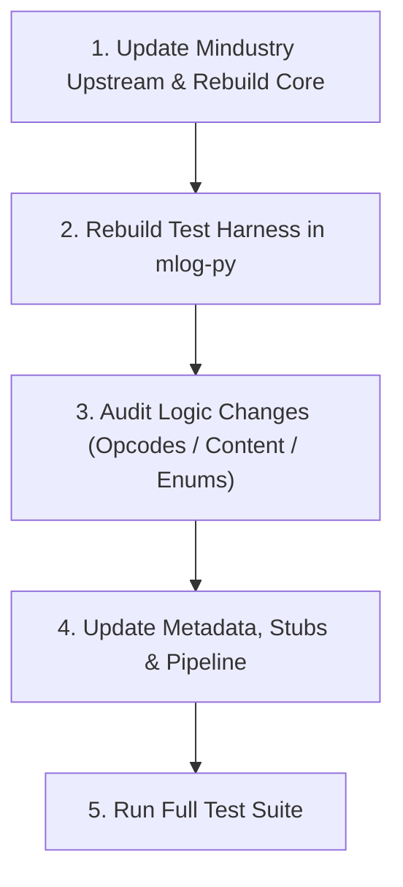

# Upstream Mindustry Update & Synchronization Guide

This guide describes the standard procedure for auditing, updating, and synchronizing `mlog-py` whenever **Mindustry** releases a new upstream version (e.g., updating from `v146` to `v147`, or from `v160.x` to `v161+`).

---

## 1. Integration Architecture Overview

`mlog-py` maintains a direct test harness bridge with the official Mindustry engine source tree located in the neighboring directory `../Mindustry`:

- **Test Harness**: `tools/harness/MindustryHarness.java` compiles independently into `build/` and runs via Java.
- **Engine Classes**: Loaded directly from `../Mindustry/core/build/classes/java/main`.
- **Arc Dependencies**: Resolved from the Gradle cache (`~/.gradle/caches/.../com.github.Anuken.Arc`) or via the `ARC_JARS_PATH` environment variable.
- **Validator & Runner**: `src/mindustry_validator.py` (`validate_with_mindustry` & `run_with_mindustry`) invokes the actual Mindustry engine to verify assembly syntax and execute runtime instructions in `LExecutor`.

---

## 2. Step-by-Step Update Procedure



### Step 1: Update Mindustry Source & Rebuild Engine Classes

Navigate to the Mindustry repository, fetch and checkout the latest tag or branch:

```bash
cd ../Mindustry
git fetch --tags origin
git checkout <new_tag>   # or git pull origin master
```

Recompile the core module `.class` files:

```bash
./gradlew :core:classes
```

### Step 2: Rebuild the Test Harness in `mlog-py`

Return to the `mlog-py` repository and recompile the Java test harness against the updated Mindustry classes:

```bash
cd ../mlog-py
python3 tools/build_harness.py --test
```

> [!TIP]
> The `--test` flag automatically runs a quick sanity check (assembling 3 sample MLog instructions). If it outputs `Sanity test passed!`, the harness is fully operational.

### Step 3: Audit Changes in Mindustry Logic

Inspect whether Mindustry modified MLog grammar, added new opcodes, changed execution semantics, or introduced new constants:

```bash
cd ../Mindustry
git diff <old_tag> <new_tag> -- core/src/mindustry/logic/
```

**Key upstream files to review:**

1. `core/src/mindustry/logic/LStatements.java`: Syntax definitions of user-facing MLog instructions.
2. `core/src/mindustry/logic/LAssembler.java`: Parser and assembler transforming MLog into bytecode.
3. `core/src/mindustry/logic/LExecutor.java`: Virtual machine executing instructions (`LVar`, `OpI`, operations).
4. `core/src/mindustry/content/`: Content definitions adding units (`UnitTypes.java`), blocks (`Blocks.java`), items (`Items.java`), or liquids (`Liquids.java`).

### Step 4: Synchronize Changes in `mlog-py` (If Applicable)

Depending on the nature of the upstream changes, update the relevant modules:

1. **New Content & Enums (Units, Items, Liquids, Sensor/Control Properties, Teams)**:
   - Update the corresponding enums in `src/mlog_registry.py`.
2. **New Opcodes or Instruction Syntax**:
   - Add the definition to the Single Source of Truth: `src/metadata.py`.
   - Regenerate IDE typing stubs (`mlog.pyi`):

     ```bash
     python3 src/metadata.py
     ```

   - Update the Compiler (AST $\to$ IR lowering): `src/compiler.py`.
   - Update the Decompiler (IR $\to$ Python structured recovery): `src/decompiler/`.
3. **Add Validation & Regression Tests**:
   - Add unit tests, round-trip tests, and engine execution assertions in `tests/`.

### Step 5: Run the Full Test Suite

Execute the entire test suite to guarantee 100% compatibility:

```bash
python3 -m unittest discover -s tests -p "test_*.py"
```

---

## 3. Quick Commands

For routine Mindustry releases that **do not alter logic syntax or opcodes** (e.g., balance tweaks, graphics, sound, gameplay bug fixes):

```bash
# 1. Update Mindustry & build core classes
cd ../Mindustry && git pull origin master && ./gradlew :core:classes

# 2. Rebuild harness & verify full mlog-py test suite
cd ../mlog-py && python3 tools/build_harness.py --test && python3 -m unittest discover -s tests -p "test_*.py"
```

If all tests pass (`OK`), `mlog-py` is verified to be fully compatible with the new upstream version without requiring code changes.
